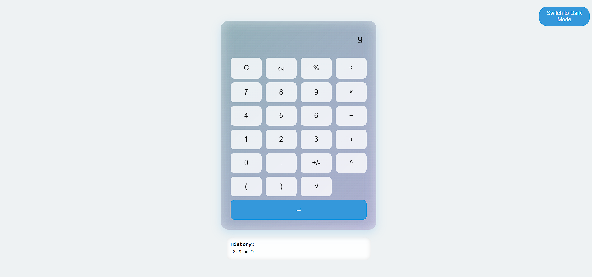
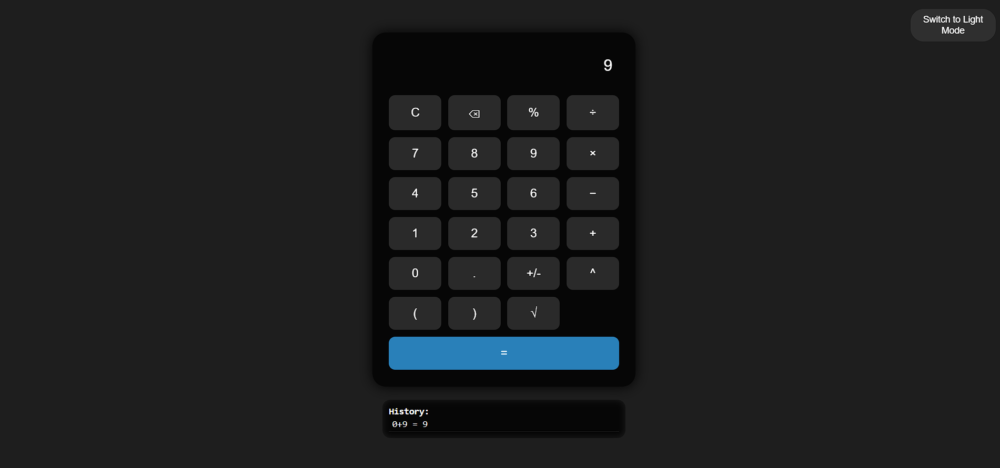

# 📱 Phone-Style Calculator

A beautiful, responsive, and fully functional calculator built using **HTML**, **CSS**, and **JavaScript**. This calculator is designed to resemble the native mobile calculator and supports all major arithmetic and scientific operations.

---

## ✨ Features

- Clean and modern UI
- Fully responsive design
- Supports:
  - ➕ Addition
  - ➖ Subtraction
  - ✖️ Multiplication
  - ➗ Division
  - 📊 Percentage (%)
  - 🔢 Power (`^`)
  - √ Square root
  - ( ) Brackets
  - +/- Toggle sign
  - ⌫ Backspace
- Error handling (shows `"Error"` for invalid expressions)

---

## 🖼️ Screenshot

> 📷 Light Mode

> 📷 dark Mode

---

## 🚀 Live Demo

[🔗 Live Demo on GitHub Pages](https://github.com/AbhipsaThakur/calculator)  
> Replace the URL with your own GitHub Pages deployment link.

---

## 🛠️ Technologies Used

- HTML5
- CSS3
- JavaScript (Vanilla)

---

## 📂 Project Structure

📁 calculator-project
│
├── 📄 index.html # Main HTML file
├── 📁 screenshots
│ └── calculator.png # Screenshot of the calculator
└── 📄 README.md # Project documentation

